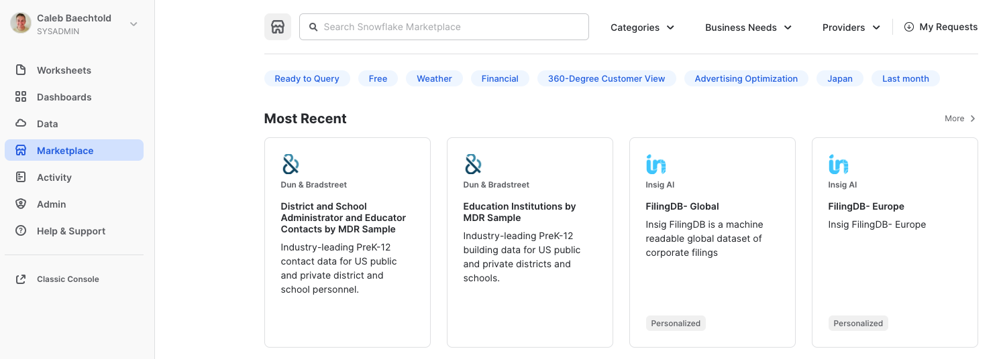
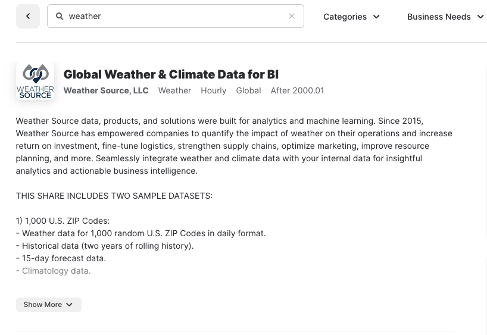

author: Caleb Baechtold
id: machine_learning_with_snowpark_python
summary: This is a sample Snowflake Guide
categories: data-science
environments: web
status: Draft
feedback link: https://github.com/Snowflake-Labs/sfguides/issues
tags: Data Science, Data Engineering, Getting Started, Machine Learning

# Machine Learning with Snowpark Python
<!-- ------------------------ -->
## Overview 
Duration: 2

Python is the language of choice for Data Science and Machine Learning workloads. Snowflake has long supported Python via the Python Connector, allowing data scientists to interact with data stored in Snowflake from their preferred Python environment. This did, however, require data scientists to write verbose SQL queries. To provide a more friendly, expressive, and extensible interface to Snowflake, we built **Snowpark Python**, a native Python experience with a pandas and PySpark-like API for data manipulation. This includes a client-side API to allow users to write Python code in a Spark-like API without the need to write verbose SQL. Python UDF and Stored Procedure support also provides more general additional capabilities for compute pushdown.

Snowpark is a matrixed offering including client-side APIs and server-side runtimes for more, common language offerings to interact with Snowflake beyond just SQL. Snowpark has support for Scala (GA), Java (PuPr), and Python (PrPr) APIs and runtimes. Ultimately, this offering provides a richer set of tools for Snowflake users (e.g. Python’s extensibility and expressiveness) while still leveraging all of Snowflake’s core features, and the underlying power of SQL, and provides a clear path to production for machine learning products and workflows.

A key component of Snowpark Python is that you can "Bring Your Own IDE"- anywhere that you can run a Python kernel, you can run client-side Snowpark Python. You can use it in your code development the exact same way as any other Python library or module. In this quickstart, we will be using Jupyter Notebooks, but you could easily replace Jupyter with any IDE of your choosing.

Throughout this quickstart, we will specifically explore the power of the Snowpark Python Dataframe API, as well as server-side Python runtime capabilities, and how Snowpark Python can enable and accelerate end-to-end Machine Learning workflows, from initial data and feature engineering all the way to production model deployment. We will even explore orchestrating model training and deployment pipelines using Apache Airflow.

The source code for this quickstart is available on [GitHub](https://github.com/sfc-gh-mgregory/snowpark-python-hol).

### Prerequisites
- Working knowledge of Python
- Familiarity with Snowflake
- Familiarity with Docker, Apache AirFlow, Streamlit a +

### What You’ll Learn 
- How to setup an Extract, Load and Transform (ELT) pipeline in Python for both bulk ingestion of ~100m time series records using the  Snowpark Python Client API as well as an incremental load process. 
- How to perform exploratory data analysis , model development, experimentation and feature engineering  using the Snowpark Python Client API and the Pytorch Tabnet framework. 
- How to create a reproducible, monitored, explainable and automated pipeline for machine learning training and inference at very large scale. 
- How to implement end-to-end machine learning workflows in Snowflake with Python (no SQL needed) which can be orchestrated with dbt, Airflow, or any other python-capable orchestration framework.


### What You’ll Need 
- A [GitHub](https://github.com/) Account
- A Snowflake Account with Snowpark Python enabled **(Note: this may not matter for PuPr)** - if you do not already have a Snowflake account, you can register for a [free trial account](https://signup.snowflake.com/)
- An [Amazon SageMaker Studio Lab](https://studiolab.sagemaker.aws/) Account OR a local Jupyter Notebook runtime with Miniconda
- [Docker Desktop](https://www.docker.com/products/docker-desktop/)

***Note: If you are planning to run this Quickstart locally, you may have additional requirements, e.g. Docker, Miniconda. Take a look at the source code [README](https://github.com/sfc-gh-mgregory/snowpark-python-hol) for more information on additional local environment requirements.***

### What You’ll Build 
- An orchestrated end-to-end Machine Learning pipeline using Snowflake, Snowpark Python, PyTorch, and Apache Airflow

<!-- ------------------------ -->
## Use-Case: Predicting Bike Share Trips 
Duration: 1

For this example, we will use the [Citibike Dataset](https://ride.citibikenyc.com/system-data). Citibike is bike-sharing service in New York City, allowing riders to check out bikes from various stations around the metro region and ride them to another destination station, constituting a trip. Our goal is to use machine learning to predict the number of trips that will be taken from each station in the network, and deploy that prediction into an operational workflow.

Importantly, at the end of each section of this Quickstart, we are going to export modular Python code for use in our end-to-end deployment and orchestration. This demonstrates your ability to use the IDE of your choice (in this case, Jupyter notebooks), to iterate, explore, and experiment, while still creating production-ready, deployable Python code.

<!-- ------------------------ -->
## Setup
Duration: 5

**Persona**: DBA/Platform Administrator

Check out the code repository README, and ensure you've followed the setup instructions for your environment of choie (AWS SageMaker Studio Lab or local Jupyter)

Then, open up the [`00-Setup`](https://github.com/sfc-gh-mgregory/snowpark-python-hol/blob/main/00-Setup.ipynb) Jupyter notebook and execute the cells. Make sure to fill in the `state_dict` at the top of this Notebook with your Snowflake account information. Then, this notebook will:
- Establish the Snowpark Python session and produce a reusable function for use throughout the remainder of the lab
- Include steps for creating user roles, warehouses, etc. if you do not already have these configured for your Snowflake demo account
- Create the CITIBIKEML_\<USER> database

Towards the end of this Notebook, you will write a function for creating and retrieving Snowpark sessions to a Python file for re-use throughout the remainder of the lab:
```python
def snowpark_connect(state_file='./include/state.json'):
    import snowflake.snowpark as snp
    import json
    
    with open(state_file) as sdf:
        state_dict = json.load(sdf)    
    
    session=None
    session = snp.Session.builder.configs(state_dict["connection_parameters"]).create()
    session.use_warehouse(state_dict['compute_parameters']['default_warehouse'])
    return session, state_dict
```

***If you are using a brand new Snowflake account***, with just a single ACCOUNTADMIN user, you'll need to run some additional steps to create additional users, initial databases, schemas, compute warehouses, etc. that we will use throughout this quickstart:
```python
session.use_role('securityadmin')

initial_password='snow2022'
new_usernames=['john1', 'john2']
project_role='PUBLIC'

for username in new_usernames:
    session.sql("CREATE USER IF NOT EXISTS "+username+\
                " PASSWORD = '"+initial_password+\
                "' LOGIN_NAME = '"+username+\
                "' DEFAULT_ROLE = '"+project_role+\
                "' MUST_CHANGE_PASSWORD = TRUE")\
            .collect()
    session.sql("GRANT ROLE "+project_role+" TO USER "+username).collect()

session.use_role('sysadmin')
session.sql("GRANT CREATE DATABASE ON ACCOUNT TO ROLE "+project_role).collect()

session.use_role(state_dict['connection_parameters']['role'])

session.use_role('accountadmin')
project_role='PUBLIC'

for wh in state_dict['compute_parameters'].values():
    session.sql("CREATE WAREHOUSE IF NOT EXISTS "+wh+\
            " WITH WAREHOUSE_SIZE = '"+wh.split('_')[0]+\
            "' WAREHOUSE_TYPE = 'STANDARD' AUTO_SUSPEND = 300 AUTO_RESUME = TRUE initially_suspended = true;")\
        .collect()
    session.sql("GRANT USAGE ON WAREHOUSE "+wh+" TO ROLE "+project_role).collect() 
    
session.use_role(state_dict['connection_parameters']['role'])

session.use_role('accountadmin')
session.sql("GRANT IMPORT SHARE ON ACCOUNT TO "+project_role).collect()
session.use_role(state_dict['connection_parameters']['role'])
```


<!-- ------------------------ -->
## Data Engineering
Duration: 10

**Persona**: Data Engineeer

We begin where all ML use cases do: data engineering. In this section of the demo, we will utilize Snowpark's Python client-side Dataframe API to build an ELT pipeline. We will extract the data from the source system (s3), load it into snowflake and add transformations to clean the data before analysis.

Open up the [`01_Data_Engineering`](https://github.com/sfc-gh-mgregory/snowpark-python-hol/blob/main/01_Data_Engineering.ipynb) notebook and execute the cells. This notebook will:
- Extract the Citbike data from S3 to a Snowflake stage
- Load the raw data to Snowflake tables
- Create tables with transformed data for use by Data Scientists
- Export the relevant DE code as Python modules and function for use in MLOps orchestration later

<!-- ------------------------ -->
## Bulk Data Ingest
Duration: 5

**Persona**: Data Engineeer

Now that we've done our initial engineering and loaded a sample of data, let's create some bulk ELT processes using the exported modules from the Data Engineering notebook.

Open up the [`01_Ingest`](https://github.com/sfc-gh-mgregory/snowpark-python-hol/blob/main/01_Ingest.ipynb) notebook. Notice the cells near the top that have the `%%time` decorator, for example:
```python
%%time
load_stage_names, files_to_load = ELT.extract_trips_to_stage(session=session, 
                                                            files_to_download=files_to_download, 
                                                            download_base_url=state_dict['download_base_url'], 
                                                            load_stage_name=state_dict['load_stage_name'])
```
These cells are meant to demonstrate the challenges associated with how the source data is stored, and zipped. If you proceed using the existing ELT functions we created in the previous section, bulk loading the data will take a long time. Instead, take a look at the bottom of this Notebook for a method to load already GZipped data from a different S3 bucket to speed up the lab:
```python
bulk_elt(session=session, 
         state_dict=state_dict, 
         download_role_ARN='arn:aws:iam::484577546576:role/citibike-demo-ml-s3-role',
         download_base_url='s3://citibike-demo-ml/data/')
```
Define and run the `bulk_elt` function to bulk-load ~94M records into your Snowflake table.

<!-- ------------------------ -->
## OPTIONAL Data Science - ARIMA Baseline Model
Duration: 10

**Persona**: Data Scientist

Our data is loaded into Snowflake. Now, we want to build a baseline ARIMA timeseries model to predict daily number of trips. You can imagine for maintenance, supply, etc. reasons why it would be useful to know how many trips are expected to be taken from each station in the Bike Share program each day. To do so, we will:
- Use Snowpark Python to query and plot the daily trip counts for the highest-volume station:
```python
snowdf = session.table(trips_table_name)

top_stations = snowdf.filter(F.col('START_STATION_ID').is_not_null()) \
                    .groupBy('START_STATION_ID') \
                    .count() \
                    .sort('COUNT', ascending=False) \
                    .toPandas()['START_STATION_ID'].values.tolist()

df = snowdf.filter(F.col('START_STATION_ID') == top_stations[0]) \
      .withColumn('DATE', 
                  F.call_builtin('DATE_TRUNC', ('DAY', F.col('STARTTIME')))) \
      .groupBy('DATE') \
      .count() \
      .sort('DATE').toPandas()

plt.figure(figsize=(15, 8))
ax = sns.lineplot(x='DATE', y='COUNT', data=df)
```
- Train an ARIMA timeseries model that includes a seasonality trend as a baseline for model performance for this task

Open up the [`02_Data_Science-ARIMA-Baseline`](https://github.com/sfc-gh-mgregory/snowpark-python-hol/blob/main/02_Data_Science-ARIMA-Baseline.ipynb) notebook, and step through the cells to see how to query data using Snowpark Python's client-side Dataframe API and train a naive timeseries model.

<!-- ------------------------ -->
## Data Science Exploration and Modeling
Duration: 15

**Persona**: Data Scientist

Now that the data engineers have cleaned and loaded the data to the `trips` table, we can begin our model development. For this, we will leverage Snowpark to do the feature preparation and exploratory analysis. This dataset is initially ~100 million rows and is likely too large to fit into memory on our local machine or even a reasonable sized single VM in the cloud. The Snowpark Python client-side Dataframe API allows us to push-down most of the computation for preparation and feature engineering to Snowpark. For security and goverance reasons we can read data into memory for model training and inference but no intermediate data products can be stored outside of Snowflake.

Open up the [`02_Data_Science`](https://github.com/sfc-gh-mgregory/snowpark-python-hol/blob/main/02_Data_Science.ipynb) notebook, and step through executing the cells. In this notebook you will:
- Query daily trip data in Snowflake using Snowpark Python and visualize time-series data
- Train a preliminary PyTorch TabNet model to predict daily trip counts
- Augment your model feature trips data with Holiday reference data, along with weather data available in the [Snowflake Data Marketplace](https://www.snowflake.com/data-marketplace/?_sft_dataset-category=weather)
- Consolidate final feature data into feature engineering functions and write them to a Python module for use by the ML engineering team to operationalize your model.

To incorporate reference weather data from the Snowflake Data Marketplace into your Snowflake account: **UPDATE NOTEBOOK TO INCLUDE SNOWSIGHT INSTRUCTIONS, confirm the reference weather dataset that we are supposed to use**
1. Go the Snowflake UI, and select `Marketplace`



2. Search for `Weather` and click on the Global Weather & Climate Data for BI tile



3. Click `Get Data` and add the dataset to your Snowflake account

^THESE INSTRUCTIONS ARE FOR THE NORMAL CITIBIKE WEATHER DATA, BUT THE LAB IS USING A DIFFERENT DATA SHARE CURRENTLY (POSSIBLY A FROSTBYTES ONE?) NEED TO UPDATE REPO AND/OR QUICKSTART

After performing your feature engineering, you will write the feature engineering functions to a Python module for use by the ML engineering team in operationalizing this end-to-end workflow.

Finally, train your TabNet regression model using the final feature set and evaluate its performance, along with feature importance:
```python
from dags.snowpark_connection import snowpark_connect
from dags.feature_engineering import generate_features
from snowflake.snowpark import functions as F
import pandas as pd

session, state_dict = snowpark_connect()
test_station_id = '519'

snowdf = session.table(state_dict['trips_table_name']).filter(F.col('START_STATION_ID') == test_station_id)

train_snowdf = generate_features(session=session, 
                                 input_df=snowdf, 
                                 holiday_table_name=state_dict['holiday_table_name'], 
                                 weather_table_name=state_dict['weather_table_name'])

df = train_snowdf.sort('DATE', ascending=True).to_pandas()
df, model, feature_columns = train_predict(df, cat_idxs=[-2], cat_dims=[2])
```


<!-- ------------------------ -->
## ML Engineering Development for ML Ops Pipelines
Duration: 10

**Persona**: ML Engineer

Your data scientists have done some exploratory analysis, feature engineering, and trained a model. Now, the ML engineer needs to develop code to deploy the model into production via an ML Ops pipeline. Open up the [`03_ML_Engineering`](https://github.com/sfc-gh-mgregory/snowpark-python-hol/blob/main/03_ML_Engineering.ipynb) notebook and step through, executing the cells. In this notebook you will:
- Materialize the additional holiday and weather data as tables
- Incorporate forecast weather data for future predictions
- Create a vectorized feature generation pipeline that allows us to train models for every station in parallel using Snowpark and Snowflake window functions
- Create a Python UDF that performs training and inference (since this is a time-series prediction) and write the predictions to a table
- Evaluate the parallel models in Snowflake using a stored procedure
- Write the relevant functions to Python modules for orchestration

TODO: update this to use vectorized UDF for training and inference 

<!-- ------------------------ -->
## Operationalizing ML Code for MLOps
Duration: 10

**Persona**: ML Engineer

The ML Engineer must now create a pipeline to automate deployment of your station-trip models, batch the predictions, and expose them in such a way that a business user can consume them via a front-end application (which will be developed in Streamlit). Most importantly, ***no data should leave Snowflake!*** Open up the [`04_ML_Ops`](https://github.com/sfc-gh-mgregory/snowpark-python-hol/blob/main/04_ML_Ops.ipynb) notebook, and walk through the code cells. In this notebook, you will:
- Take the functions created by the Data Scientist and ML Engineer and wrap them in such a way that they can be easily automated using the company's orchestration tools (Airflow)
- Deploy the model training and inference as a permanent [Python Snowpark User-Defined Function (UDF)](https://docs.snowflake.com/en/LIMITEDACCESS/snowpark-python.html#creating-user-defined-functions-udfs-for-dataframes)
- Use [Zero-Copy Cloning](https://docs.snowflake.com/en/sql-reference/sql/create-clone.html) in Snowflake to produce point-in-time snapshots of the data in order to reproduce results on-demand in the future, withtout creating physical copies of any data
- Use [object tagging](https://docs.snowflake.com/en/user-guide/object-tagging.html) to tag training/inference datasets with a `model_id` for lineage
- Test out the pipeline that will eventually orchestrated
- Consolidate the monthly training/inference operation into a single deployable pipeline

```python
%%writefile dags/mlops_monthly_pipeline.py

from dags.mlops_tasks import snowpark_database_setup
from dags.mlops_tasks import incremental_elt_task
from dags.mlops_tasks import materialize_holiday_task
from dags.mlops_tasks import materialize_weather_task
from dags.mlops_tasks import deploy_model_udf_task
from dags.mlops_tasks import deploy_eval_udf_task
from dags.mlops_tasks import generate_feature_table_task
from dags.mlops_tasks import generate_forecast_table_task
from dags.mlops_tasks import bulk_train_predict_task
from dags.mlops_tasks import eval_station_models_task 
from dags.mlops_tasks import flatten_tables_task

def citibikeml_monthly_taskflow(files_to_download:list, run_date:str):
    """
    End to end Snowflake ML Demo
    """
    import uuid
    import json

    with open('./include/state.json') as sdf:
        state_dict = json.load(sdf)
    
    model_id = str(uuid.uuid1()).replace('-', '_')

    state_dict.update({'model_id': model_id})
    state_dict.update({'run_date': run_date})
    state_dict.update({'load_table_name': 'RAW_',
                       'trips_table_name': 'TRIPS',
                       'load_stage_name': 'LOAD_STAGE',
                       'model_stage_name': 'MODEL_STAGE',
                       'weather_table_name': 'WEATHER',
                       'holiday_table_name': 'HOLIDAYS',
                       'clone_table_name': 'CLONE_'+model_id,
                       'feature_table_name' : 'FEATURE_'+model_id,
                       'pred_table_name': 'PRED_'+model_id,
                       'eval_table_name': 'EVAL_'+model_id,
                       'forecast_table_name': 'FORECAST_'+model_id,
                       'forecast_steps': 30,
                       'train_udf_name': 'station_train_predict_udf',
                       'train_func_name': 'station_train_predict_func',
                       'eval_udf_name': 'eval_model_output_udf',
                       'eval_func_name': 'eval_model_func'
                      })
    
    #Task order - monthlyl incremental
    incr_state_dict = incremental_elt_task(state_dict, files_to_download)
    feature_state_dict = generate_feature_table_task(incr_state_dict, incr_state_dict, incr_state_dict) 
    forecast_state_dict = generate_forecast_table_task(incr_state_dict, incr_state_dict, incr_state_dict)
    pred_state_dict = bulk_train_predict_task(feature_state_dict, feature_state_dict, forecast_state_dict)
    eval_state_dict = eval_station_models_task(pred_state_dict, pred_state_dict, run_date)
    state_dict = flatten_tables_task(pred_state_dict, eval_state_dict)

    return state_dict
```
<!-- ------------------------ -->
## Orchestration with Apache Airflow
Duration: 10

**Persona**: ML Engineer

Now that we have created Python code that is meant to support operational deployments of our model training and inference tasks, we need to wrap these functions as Airflow tasks for easy orchestration. **Note:** this section requires `Docker Desktop` to run.

**TODO:** Add in Airflow DAG image

Open up the [`05_Airflow_Pipeline`](https://github.com/sfc-gh-mgregory/snowpark-python-hol/blob/main/05_Airflow_Pipeline.ipynb) notebook. We will define Airflow tasks using the `@task()` decorator:
```python
@task()
def generate_forecast_table_task(state_dict:dict, 
                                 holiday_state_dict:dict, 
                                 weather_state_dict:dict)-> dict: 
    from dags.snowpark_connection import snowpark_connect
    from dags.mlops_pipeline import create_forecast_table

    print('Generating forecast features.')
    session, _ = snowpark_connect()

    _ = create_forecast_table(session, 
                              trips_table_name=state_dict['trips_table_name'],
                              holiday_table_name=state_dict['holiday_table_name'], 
                              weather_table_name=state_dict['weather_table_name'], 
                              forecast_table_name=state_dict['forecast_table_name'],
                              steps=state_dict['forecast_steps'])

    _ = session.sql("ALTER TABLE "+state_dict['forecast_table_name']+\
                    " SET TAG model_id_tag = '"+state_dict['model_id']+"'").collect()

    session.close()
    return state_dict
```
Then, we will define an Airflow dag using the `@dag` decorator:
```python
%%writefile dags/airflow_incremental_pipeline.py

from datetime import datetime, timedelta

from airflow.decorators import dag, task
from dags.airflow_tasks import snowpark_database_setup
from dags.airflow_tasks import incremental_elt_task
from dags.airflow_tasks import initial_bulk_load_task
from dags.airflow_tasks import materialize_holiday_task
from dags.airflow_tasks import materialize_weather_task
from dags.airflow_tasks import deploy_model_udf_task
from dags.airflow_tasks import deploy_eval_udf_task
from dags.airflow_tasks import generate_feature_table_task
from dags.airflow_tasks import generate_forecast_table_task
from dags.airflow_tasks import bulk_train_predict_task
from dags.airflow_tasks import eval_station_models_task 
from dags.airflow_tasks import flatten_tables_task

default_args = {
    'owner': 'airflow',
    'depends_on_past': False,
    'email_on_failure': False,
    'email_on_retry': False,
    'retries': 1,
    'retry_delay': timedelta(minutes=5)
}

#local_airflow_path = '/usr/local/airflow/'

@dag(default_args=default_args, schedule_interval=None, start_date=datetime(2020, 4, 1), catchup=False, tags=['monthly'])
def citibikeml_monthly_taskflow(files_to_download:list, run_date:str):
    """
    End to end Snowpark / Astronomer ML Demo
    """
    import uuid
    import json
    
    with open('./include/state.json') as sdf:
        state_dict = json.load(sdf)
    
    model_id = str(uuid.uuid1()).replace('-', '_')

    state_dict.update({'model_id': model_id})
    state_dict.update({'run_date': run_date})

    state_dict.update({'load_table_name': 'RAW_',
                       'trips_table_name': 'TRIPS',
                       'load_stage_name': 'LOAD_STAGE',
                       'model_stage_name': 'MODEL_STAGE',
                       'weather_table_name': 'WEATHER',
                       'holiday_table_name': 'HOLIDAYS',
                       'clone_table_name': 'CLONE_'+model_id,
                       'feature_table_name' : 'FEATURE_'+model_id,
                       'pred_table_name': 'PRED_'+model_id,
                       'eval_table_name': 'EVAL_'+model_id,
                       'forecast_table_name': 'FORECAST_'+model_id,
                       'forecast_steps': 30,
                       'train_udf_name': 'station_train_predict_udf',
                       'train_func_name': 'station_train_predict_func',
                       'eval_udf_name': 'eval_model_output_udf',
                       'eval_func_name': 'eval_model_func'
                      })

    incr_state_dict = incremental_elt_task(state_dict, files_to_download)
    feature_state_dict = generate_feature_table_task(incr_state_dict, incr_state_dict, incr_state_dict) 
    forecast_state_dict = generate_forecast_table_task(incr_state_dict, incr_state_dict, incr_state_dict)
    pred_state_dict = bulk_train_predict_task(feature_state_dict, feature_state_dict, forecast_state_dict)
    eval_state_dict = eval_station_models_task(pred_state_dict, pred_state_dict, run_date)
    state_dict = flatten_tables_task(pred_state_dict, eval_state_dict)

    return state_dict
```
We use the [Astronomer dev CLI](https://github.com/astronomer/astro-cli) and Docker to spin up a local Airflow instance:
```
!curl -sSL https://install.astronomer.io | sudo bash -s
!brew install docker
!brew install colima
!docker context use colima
!colima start
!DOCKER_BUILDKIT=0 docker build --build-arg PYTHON_MAJOR_MINOR_VERSION=3.8 -t ap-airflow:py38 https://github.com/astronomer/ap-airflow.git#master:2.2.5/bullseye/

!astro dev start
```
We can then run the following to trigger the Airflow pipeline from a command-line shell (this is meant to be executed from a Jupyter shell):
```
#This sample code can be used to trigger the Airflow pipeline from a command-line shell.
!curl -X POST 'http://localhost:8080/api/v1/dags/citibikeml_monthly_taskflow/dagRuns' \
-H 'Content-Type: application/json' \
--user "admin:admin" \
-d '{"conf": {"files_to_download": ["202003-citibike-tripdata.csv.zip"], "run_date": "2020_04_01"}}'
```

<!-- ------------------------ -->
## Integration with Streamlit for Model Consumption
Duration: 10

**Persona**: Application Developer / Data Scientist

Streamlit is an open-source app framework for ML and Data Science teams that allows non-application developers to turn data scripts into shareable web apps in very little time, all using pure Python, without any front-end experience required.

In the [`06_Streamlit_App`](https://github.com/sfc-gh-mgregory/snowpark-python-hol/blob/main/06_Streamlit_App.ipynb) notebook, we will build a Streamlit app that allows users to consume the results of our model predictions in a simple, front-end web application. Users can also trigger the Airflow pipeline to ingest data, train our model, and perform infeerence.

Run the cell that contains all the code for building the Streamlit app. Then, run the following cell to launch the app:
```python
#If running in SageMaker Studio Lab update the domain name from the URL above:
studiolab_domain = 'XXXXXXXXXXXXXXX'

# launch
if studiolab_domain == 'XXXXXXXXXXXXXXX':
    url = f'https://localhost:6006'
    
else: 
    studiolab_region = 'us-east-2'
    url = f'https://{studiolab_domain}.studio.{studiolab_region}.sagemaker.aws/studiolab/default/jupyter/proxy/6006/'

print(f'Wait a few seconds and then click the link below to open your Streamlit application \n{url}\n')    
!streamlit run --theme.base dark streamlit_app.py --server.port 6006
```
Navigate to your Streamlit app on port `6006`:

**TODO:** insert screenshot of Streamlit app

Notice in the app that you can...


<!-- ------------------------ -->
## Conclusion
Duration: 2

In this quickstart we demonstrated how Snowpark Python enables rapid, end-to-end machine learning workload development, deployment, and orchestration. 

For the Data Engineer, Snowpark Python simplifies ELT pipeline development using common Dataframe API syntax, that also exposes the expressiveness and extensiveness of Python. Norming on Python as the language of choice also allows rapid iteration between Data Scientists and Data Engineers, eliminating any expensive code translation lift that can introduce additional time and cost to machine learning workflow development.

For the Data Scientist, Snowpark Python provides a familiar API for querying, acquiring, transforming, and exploring data that resides in Snowflake, while also providing the compute benefits of push-down query execution at little to zero additional time and cost. Snowpark abstracts compute away from the data scientist's IDE of choice, be that a Notebook environment, or more typical IDE. The server-side Snowpark Python runtime enables data scientists to immediately deploy training and inference code to Snowflake with a single line of code. And, all of this is done without having to write a single line of verbose SQL.

For the ML Engineer, Snowpark Python simplifies the hand-off of experimental/analysis code from the data scientist into production-level workflows. By simply extending the experimental code into more robust Python modules, the ML engineer can turn an ML project from experiment to product in little to no time. He or she can then orchestrate a fully operational ML pipeline using the business's orchestration tool of choice, such as Airflow in this example.

Importantly, we showed how working in Snowpark Python allows you to "Bring Your Own IDE" with limited-to-zero dependencies outside of a Python kernel runtime environment, keeping things developer-friendly and allowing teams to work in their preferred dev environments.

For more information on Snowpark Python, and Machine Learning in Snowflake, check out the following resources: